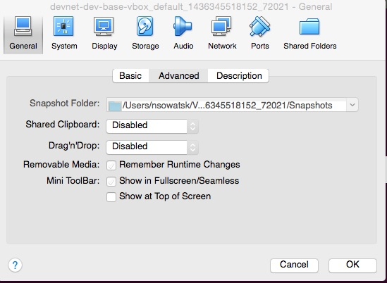

# Things That Go Wrong

Vagrant is really useful and all, but not perfect, and sometimes
fails. This is a collection of failures witnessed and what was done to fix the problem.

## Network Failure During Up

This error happened when there was a network connectivity failure
during the download, see `SSL read: error:00000000:lib(0):func(0):reason(0), errno 60
` below.

Use `rm -rf ~/.vagrant.d/tmp/` to remove the temporary download data and try again. See the
full trace below.

```bash
$ vagrant up --provider=vmware_fusion
Bringing machine 'default' up with 'vmware_fusion' provider...
==> default: Box 'CiscoDevNet/devnet-dev-base-vmware' could not be found. Attempting to find and install...
    default: Box Provider: vmware\_desktop, vmware\_fusion, vmware\_workstation
    default: Box Version: >= 0
==> default: Loading metadata for box 'CiscoDevNet/devnet-dev-base-vmware'
    default: URL: https://atlas.hashicorp.com/CiscoDevNet/devnet-dev-base-vmware
==> default: Adding box 'CiscoDevNet/devnet-dev-base-vmware' (v0.0.2) for provider: vmware_desktop
    default: Downloading: https://atlas.hashicorp.com/CiscoDevNet/boxes/devnet-dev-base-vmware/versions/0.0.2/providers/vmware_desktop.box
An error occurred while downloading the remote file. The error
message, if any, is reproduced below. Please fix this error and try
again.

SSL read: error:00000000:lib(0):func(0):reason(0), errno 60

$ rm -rf ~/.vagrant.d/tmp/
```

##  The box you attempted to add doesn't match the provider you specified

This happens, it appears, when the metadata.json *in* the manually created VMware
box bundle defines specific providers for VMware,
e.g. "vmware\_fusion" and/or "vmware\_workstation". This is a  glitch in Vagrant that ought to be fixed, but clearly is
not that important yet.

See this post for an example of the issue:

https://groups.google.com/forum/#!topic/vagrant-up/qhmw5SUdaic


```bash
$ vagrant up --provider=vmware\_fusion
...
The box you attempted to add doesn't match the provider you
specified

Provider expected: vmware\_desktop
Provider of box: vmware\_fusion
```

What makes this especially confusing is that a box added locally works
as expected with the provider of "vmware\_fusion" in the
metadata.json. However, when one adds the box to atlas with an internal
provider of "vmware\_fusion", and an Atlas provider of
"vmware\_desktop" (which is the only available "vmware" provider in Atlas), and then attempts to up it from Atlas,
one sees the message above.

In the process of trying different permutations and combintations
here, it was discovered that *removing* the
"vmware\_desktop" provider for the box in Atlas resulted in this error:


```bash
$ vagrant up --provider=vmware\_fusion
...
An error occurred while downloading the remote file. The error
message, if any, is reproduced below. Please fix this error and try
again.

The requested URL returned error: 404 Not Found
```

The combination that appears to work for both locally added boxes
*and* boxes in Atlas is to use "vmware_desktop" as the provider in the
metadata,json file in the box, and for the provider in Atlas, and
*not* to add fusion or workstation specific providers.

## Your machine can't be started while VMware networking is broken.

One might witness this when running Cisco AnyConnect with a policy that
prevents split tunnelling, as the attempt to start up networking for the
VM is interpreted, in effect, as an attempt to create another network
connection to a different network:

``` bash
$ vagrant up --provider=vmware\_fusion
Bringing machine 'default' up with 'vmware_fusion' provider...
==> default: Cloning VMware VM: 'devnet-dev-base-vmware'. This can take some time...
==> default: Verifying vmnet devices are healthy...
The VMware network device 'vmnet1' can't be started because
its routes collide with another device: 'utun1'. Please
either fix the settings of the VMware network device or stop the
colliding device. Your machine can't be started while VMware
networking is broken.

Routing to the IP '192.168.28.0' should route through 'vmnet1', but
instead routes through 'utun1'.
```

Simply disconnect AnyConnect, with or without quitting, and try
again. Note that one can start AnyConnect again after the VM is
runnng, and that VM, assuming it is NAT'ed, and so sharing the host's
network connection, will  be able to connect to the VPN headend and
networks beyond also. The host, though, will not be able to connect to
the VM via a network socket directly, though one can use the GUI of
the VM.

## VMware GUI

If, in the Vagrantfile, `vmw.gui = false`, where `vmw` is the short
form from `config.vm.provider "vmware_fusion" do |vmw|`, then no
visible sign of VMware Fusion appears, though the VM is clearly
running as the provisioning commands from the Vagrantfile are being executed.

This is not wrong, so much as unexpected in comparison to VBox.

## Provisioning Fails to Start With Fusion

One ups the VM, as below, and then .... nothing.

```bash
$ vagrant up --provider=vmware_fusion
Bringing machine 'default' up with 'vmware_fusion' provider...
==> default: Checking if box 'CiscoDevNet/devnet-dev-base-vmware' is up to date...
==> default: Verifying vmnet devices are healthy...
==> default: Starting the VMware VM...
```

Trying again a second time seems to work.

## VBox Copy-and-Paste Not Working

If copy-and-paste for a VBox VM is not working, it is likely that the
Shared Clipboard is not enabled. See the image below for a
solution. Note that this is enabled in the Vagrantfile, but that seems
not to work on occasion.

 


